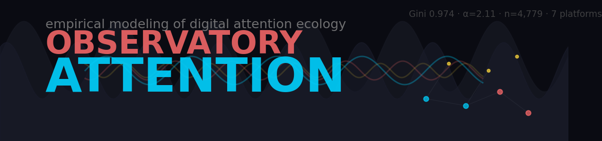

<p align="center">
  
</p>

# ATTENTION OBSERVATORY — Empirical Economics of Digital Attention


> **Modeling human attention as a finite ecological resource. 7 data sources, NLP, power law analysis, and econometric validation.**

---

## Elevator Pitch

**Problem**: Digital platforms compete for a finite resource — human attention. But the structures governing attention distribution (power laws, Gini inequality, sentiment-impact decoupling) are poorly understood. Most analysis moralizes social media rather than measuring it with mathematical rigor.

**Hypothesis**: Attention follows a scale-free network topology (Barabasi-Albert) where winner-takes-all dynamics dominate. Sentiment does not predict engagement. Platform inequality is universal (Gini > 0.85 across all platforms).

**Solution**: An empirical observatory ingesting data from **7 platforms** (Hacker News, Wikipedia, HuggingFace, Bluesky, Mastodon, GitHub, YouTube), processing **16,402 posts** from **4,779 actors** through a bronze/silver/gold ELT pipeline with NLP (distilbert transformers), power law fitting (MLE), Gini coefficients, and longitudinal tracking.

---

## Key Research Findings

| Question | Answer | Evidence |
|----------|--------|----------|
| P1: Does attention follow power law? | **Yes** (HN a=2.69, Bluesky a=2.29) | MLE power law fitting |
| P2: Does sentiment predict engagement? | **No** (rho=0.045, p=0.13) | Sentiment-engagement decoupling |
| P3: Which actors have highest leverage? | **8 high-leverage nodes** (Bluesky) | Cook's Distance > threshold |
| P4: Does production pressure correlate with prestige? | Weak negative (rho=-0.088, p=0.003) | Higher output = lower prestige |
| P5: Are there platform differences? | **All Gini > 0.85** | Mastodon 0.968 > GitHub 0.962 > HN 0.903 > Bluesky 0.869 |
| P6: Do super-hubs have distinct profiles? | **Yes** (low PPI, high AFI) | Mutation to qualitative capital |

## Key Metrics

| Metric | Value |
|--------|-------|
| Total Actors | **4,779** |
| Total Posts | **16,402** |
| Active Platforms | **7** (HN, Wikipedia, HuggingFace, Bluesky, Mastodon, GitHub, YouTube) |
| Global Gini | **0.974** (extreme concentration) |
| Power Law Alpha | **2.11** (Pareto distribution) |
| Super-hubs (Z > 3) | **15** nodes |
| NLP Model | Transformers (distilbert) |
| Analytical Layers | 6 (Capital Conversion, Legal Enclosure, Prestige Drift, Anomaly Detection, Super-Hub Detection, Systemic Breakdown) |

## Methodology

```mermaid
BRONZE (raw)                    SILVER (cleansed)              GOLD (feature space)
   7 sources --> parquet          Polars: typing, merge          4,779 actors as
   no transforms                 NLP (distilbert)                vectors [ER, PPI, Sentiment, AFI]
                                 feature engineering             + stats + snapshot
```

## Feature Space

Each actor is a 4-dimensional vector:

| Feature | Definition | Formula | Measures |
|---------|-----------|---------|----------|
| **ER** | Engagement Rate | (interactions / followers) * 100 | Audience mobilization capacity |
| **PPI** | Pressure Index | 1 / ln(interval_h + 1.01) | Publishing urgency/anxiety |
| **Sentiment** | NLP Score | [-1, 1] | Emotional tone (distilbert) |
| **AFI** | Aspirational Framing Index | Prestige keyword density | Cultural legitimation strategy |

## Statistical Methods

| Method | Application |
|--------|-----------|
| Gini Coefficient | Engagement inequality across platforms |
| Lorenz Curve | Cumulative concentration visualization |
| Power Law (MLE, Clauset 2009) | Heavy-tail distribution fitting |
| Cook's Distance | High-leverage node identification |
| Z-score | Super-hub detection (outliers) |
| Bootstrap | Confidence intervals for Gini |
| Spearman / Pearson | Feature correlations |

## Dashboard (Streamlit, 6 tabs)

| Tab | Content |
|-----|---------|
| **Overview** | Global metrics, platform distribution, top actors |
| **Inequality** | Lorenz curve, Power Law, Gini by platform |
| **Research** | Dedicated panels for findings P1-P6 |
| **Longitudinal** | Historical tracking of Gini, alpha, hubs |
| **State Space** | 3D scatter (ER x PPI x Sentiment), leverage plot |
| **Actors** | Individual explorer with full metrics |

## Methodology: Spec-Driven Development

```
Manifesto -> Hypothesis -> Metric -> Code -> Validation
```

Each metric, transformation, and analytical layer is explicitly derived from specification documents (`manifiestos/`). Full traceability in [`ROADMAP.md`](ROADMAP.md).

---

## Author

**Juan de la Fuente** — [@juandelaf1](https://github.com/juandelaf1)

juandelafuentelarrocca@gmail.com
