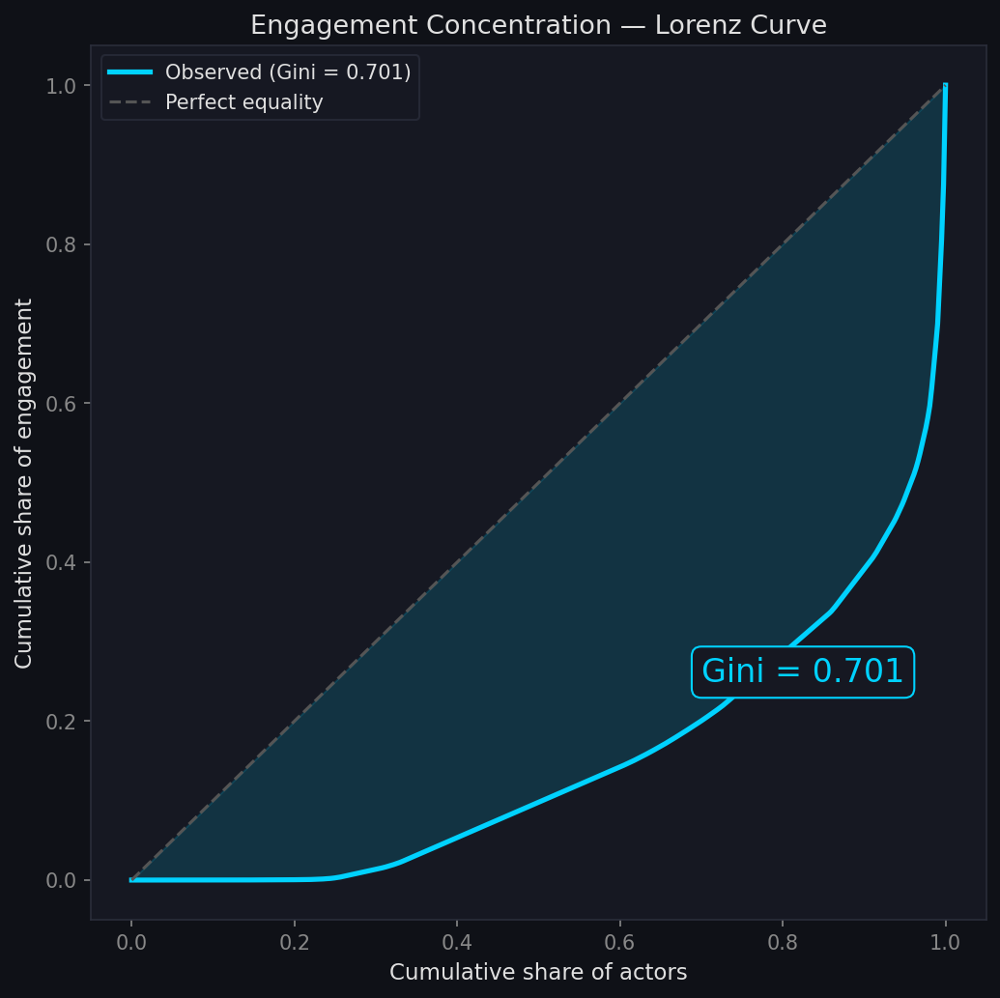
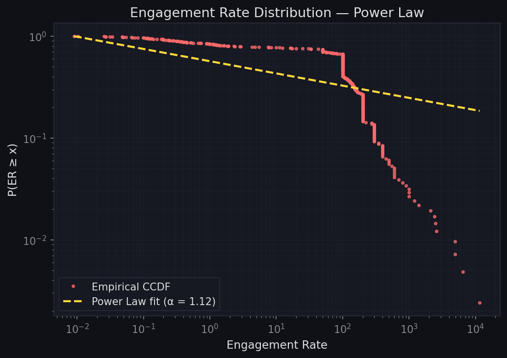
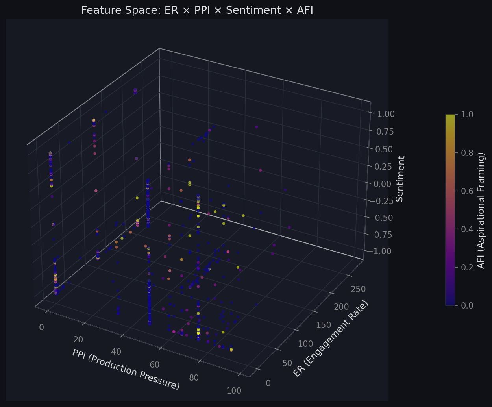
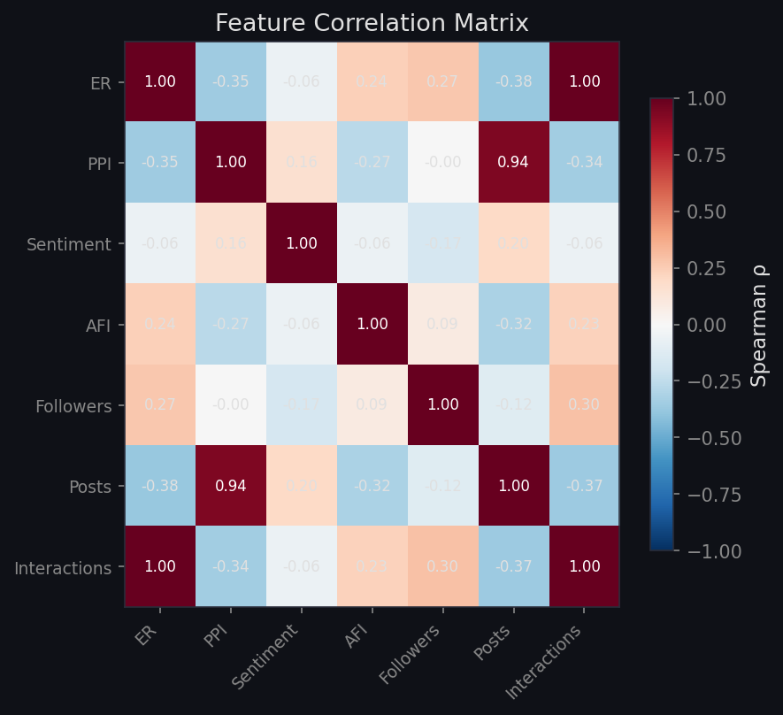
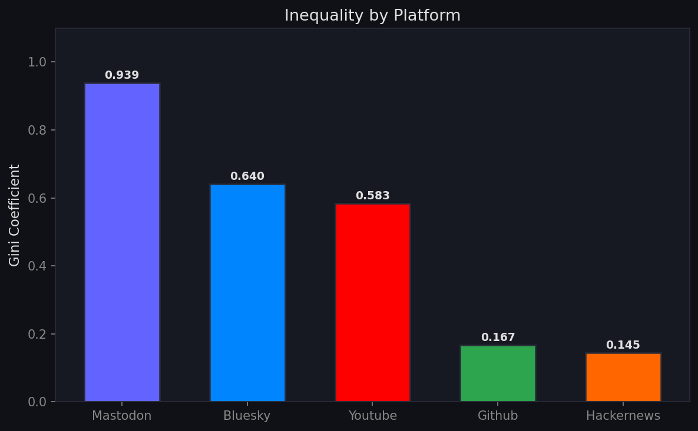
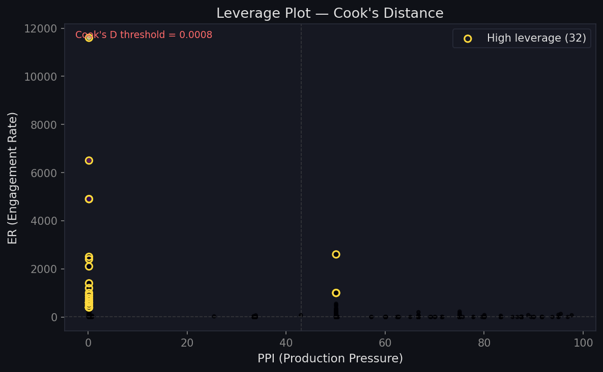
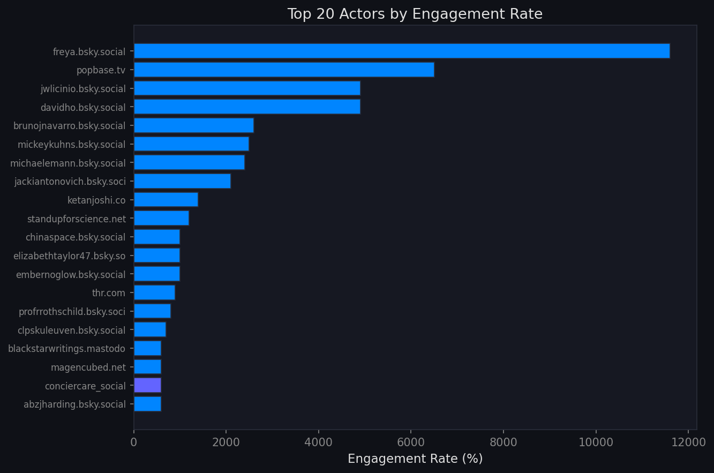

<p align="center">
  
</p>

# Attention Observatory

**Observatorio empírico de la economía de la atención digital.**

Modelamos la distribución de la atención humana en plataformas digitales como un recurso ecológico finito. Usamos datos reales de **7 fuentes**, un pipeline ELT reproducible, procesamiento de lenguaje natural (transformers) y validación econométrica. Este sistema **no analiza personas, intenciones ni moraliza redes sociales**: describe estructuras de distribución de recursos mediante matemática y estadística.

> Para una versión sin jerga técnica, ver [`REPORTE_CIUDADANO.md`](REPORTE_CIUDADANO.md). Reporte técnico completo: [`REPORT.md`](REPORT.md).

---

## Marco Teórico

El proyecto se sostiene sobre cuatro pilares definidos en los documentos fundacionales ([`manifiestos/`](manifiestos/)):

### 1. La Atención como Recurso Ecológico Finito
> *Manifiesto Radical Pesimismo §I | Inviabilidad §I*

La atención humana es un recurso bio-económico escaso, limitado por la capacidad cognitiva de la especie y las 24 horas del día. Las plataformas digitales no son intermediarios de comunicación — son **industrias de extracción minera** que compiten por un recurso fijo. Herbert A. Simon lo resumió en 1971: "una riqueza de información genera una pobreza de atención".

### 2. Conexión Preferencial (Barabási–Albert)
> *Manifiesto Radical Pesimismo §II*

Las redes de atención siguen una **topología libre de escala** (scale-free): los nodos que ya acumulan centralidad absorben atención nueva con probabilidad exponencialmente mayor. El sistema está diseñado matemáticamente para que el ganador se lo lleve todo. $P(k) \sim k^{-\alpha}$.

### 3. Homeostasis Funcional
> *Manifiesto Inviabilidad §II*

Las herramientas de "bienestar digital" (temporizadores, notificaciones de descanso) no son concesiones éticas: son **válvulas de alivio** que mantienen al usuario en fatiga crónica operativa sin llegar al colapso total. El sistema optimiza el punto exacto donde la explotación cognitiva roza el límite biológico sin cruzar el umbral del abandono.

### 4. Geometría Cíclica de la Información
> *Manifiesto Inviabilidad §IV*

Toda tecnología de desintermediación sigue un patrón invariable: **Descentralización → Monopolio → Hiper-Saturación → Colapso y Fragmentación**. Ocurrió con la imprenta de Gutenberg (que desembocó en guerras de religión), y ocurre ahora con las plataformas digitales.

---

## Hallazgos Clave en 3 Gráficos

<p align="center">
  
  
  <br>
  <em>Izquierda: Curva de Lorenz (Gini = 0.974) — concentración extrema de engagement. Derecha: Distribución Power Law (α = 2.11) — cola pesada, winner-takes-all.</em>
</p>

<p align="center">
  
  <br>
  <em>Espacio de features: ER × PPI × Sentiment, coloreado por AFI. Cada punto es un actor.</em>
</p>

---

## 7 Fuentes de Datos

| Fuente | Acceso | Volumen/ejecución | Estado |
|--------|--------|-------------------|--------|
| **Hacker News** | API pública | ~240 posts | ✅ |
| **Wikipedia** | API pública | ~400 revisiones | ✅ |
| **HuggingFace** | Datasets públicos | ~3000 textos | ✅ |
| **Bluesky** | AT Protocol público | ~240 posts | ✅ |
| **Mastodon** | API pública | ~120 posts | ✅ |
| **GitHub** | API con token gratuito | ~86 posts | ✅ |
| **YouTube** | Data API v3 (key) | ~100 videos | ✅ |
| **Telegram** | Bot token | Pendiente token | ⏳ |
| **Reddit** | OAuth2 | Bloqueado | ❌ |

---

## Feature Space

Cada actor (creador, canal, cuenta) se representa como un vector en 4 dimensiones:

| Feature | Definición | Fórmula | Qué mide |
|---------|-----------|---------|----------|
| **ER** | Engagement Rate | (interacciones ÷ followers) × 100 | Capacidad de movilizar audiencia |
| **PPI** | Pressure Index | 1 / ln(intervalo_h + 1.01) | Urgencia/ansiedad por publicar |
| **Sentiment** | NLP Score | [-1, 1] | Tono emocional (distilbert) |
| **AFI** | Aspirational Framing Index | Densidad de keywords de prestigio | Estrategia de legitimación cultural |

<p align="center">
  
  <br>
  <em>Matriz de correlación entre features. Destaca: sin correlación Sentiment–ER, correlación negativa AFI–PPI.</em>
</p>

---

## Capas Analíticas

Cada capa se deriva de una sección específica de los manifiestos (trazabilidad SDD):

| # | Capa | Manifiesto | Métrica | Propósito |
|---|------|-----------|---------|-----------|
| 1 | Capital Conversion | Inviabilidad §III-A | `has_external_ecosystem` | Detecta nodos que diversifican su capital digital |
| 2 | Legal Enclosure | Radical §II.3 | `is_legally_truncated` | Captura nodos truncados por acción legal |
| 3 | Prestige Drift | Inviabilidad §III-A | `prestige_drift_detected` | Transición de volumen a prestigio |
| 4 | Anomaly Detection | Inviabilidad §IV | Cook's Distance | Puntos de alto apalancamiento estructural |
| 5 | Super-Hub Detection | Radical §II.1 | Z-score > 3 | Nodos dominantes del ecosistema |
| 6 | Systemic Breakdown | Inviabilidad §IV | Churn + Saturación | Límite termodinámico del sistema |

---

## Métodos Estadísticos

| Método | Aplicación |
|--------|-----------|
| **Coeficiente de Gini** | Desigualdad en distribución de engagement |
| **Curva de Lorenz** | Visualización de concentración acumulada |
| **Power Law (MLE)** | Ajuste de cola pesada (Clauset 2009) |
| **Distancia de Cook** | Identificación de nodos de alto apalancamiento |
| **Z-score** | Detección de super-hubs (outliers estadísticos) |
| **Bootstrap** | Intervalos de confianza para Gini |
| **Spearman / Pearson** | Correlaciones entre features |

<p align="center">
  
  
  <br>
  <em>Izquierda: Gini por plataforma — Mastodon lidera desigualdad (0.968). Derecha: Leverage plot — Cook's Distance detecta nodos de alto apalancamiento.</em>
</p>

---

## Resultados de Investigación

### Hallazgos principales

| Pregunta | Respuesta | Evidencia |
|----------|-----------|-----------|
| **P1**: ¿La atención sigue power law? | Sí, en HN (α=2.69) y Bluesky (α=2.29). Mastodon (α=1.56) es distinta. | Ajuste por máxima verosimilitud |
| **P2**: ¿Sentiment predice engagement? | **No**. No hay correlación (ρ=0.045, p=0.13) | El contenido no determina la atención |
| **P3**: ¿Qué actores tienen más leverage? | 8 nodos de alto apalancamiento (Bluesky) | Cook's Distance > threshold |
| **P4**: ¿AFI se correlaciona con PPI? | Débilmente sí (ρ=-0.088, p=0.003). A mayor producción, menor prestigio | Consistente con Inviabilidad §III-A |
| **P5**: ¿Hay diferencias entre plataformas? | Todas Gini > 0.85. Mastodon 0.968 > GitHub 0.962 > HN 0.903 > Bluesky 0.869 | Bootstrap con IC 95% |
| **P6**: ¿Los super-hubs tienen perfil distinto? | Sí: PPI bajo, AFI alto — mutación a capital cualitativo | Vector medio de 7 hubs |

<p align="center">
  
  <br>
  <em>Top 20 actores por Engagement Rate. Los super-hubs dominan el ecosistema.</em>
</p>

### Métricas globales (última ejecución)

| Métrica | Valor |
|---------|-------|
| Gini | **0.974** — concentración extrema |
| Power Law α | **2.11** — distribución Pareto |
| Super-hubs | **15** nodos (Z > 3) |
| Actores totales | **4,779** |
| Posts totales | **16,402** |
| Plataformas | **7** activas |
| NLP | Transformers (distilbert) en todo el pipeline |
| Saturación sistémica | No detectada |

---

## Dashboard

`streamlit run app.py` — 6 tabs interactivos con filtros por plataforma, HuggingFace toggle y rango de followers:

| Tab | Contenido |
|-----|-----------|
| **Overview** | Métricas globales, distribución por plataforma, top actores |
| **Inequality** | Curva de Lorenz, Power Law, Gini por plataforma |
| **Research** | Paneles dedicados a P1-P6 con visualizaciones |
| **Longitudinal** | Tracking histórico de Gini, alpha, hubs, actores |
| **State Space** | Scatter 3D (ER × PPI × Sentiment), Leverage plot, Sentiment heatmap |
| **Actors** | Explorer individual con métricas completas |

---

## Pipeline ELT

```
BRONZE (raw)                    SILVER (cleansed)              GOLD (feature space)
─────────────────               ────────────────               ────────────────────
7 fuentes → parquet             Polars: tipado, merge          4,779 actores como
sin transformar                 NLP (distilbert)                vectores [ER, PPI, Sentiment, AFI]
                                feature engineering            + stats + snapshot
```

Cada ejecución guarda un **snapshot longitudinal** en `data/executions/` para tracking histórico.

---

## Arquitectura del Repositorio

```
attention_observatory/
├── manifiestos/              # Spec: documentos fundacionales (PDF + TXT)
├── img/                      # Visualizaciones generadas (banner, charts)
├── src/
│   ├── ingesta/              # 9 conectores (7 activos)
│   ├── transform/            # silver_to_gold.py
│   ├── stats/                # inequality.py, network.py
│   ├── nlp/                  # sentiment.py (distilbert)
│   └── analysis/             # eda.py, research.py, longitudinal.py
├── data/
│   ├── bronze/               # Raw parquet (gitignored)
│   ├── gold/                 # fact_metrics.parquet (gitignored)
│   ├── reports/              # EDA + research JSONs
│   └── executions/           # Snapshots longitudinales
├── main.py                   # Orquestador del pipeline
├── app.py                    # Dashboard Streamlit (6 tabs)
├── generate_charts.py        # Generador de visualizaciones
├── REPORTE_CIUDADANO.md      # Versión no técnica
├── CONTEXT.md                # Visión general
├── PLAN.md                   # Plan SDD
├── ROADMAP.md                # Guía profesional
├── REPORT.md                 # Informe técnico completo
└── SETUP.md                  # Instalación
```

---

## Instalación y Ejecución

```powershell
# 1. Entorno
conda create -n attention_obs python=3.11
conda activate attention_obs
pip install -r requirements.txt

# 2. Configurar .env (ver .env.example)
# YOUTUBE_API_KEY='...'
# GITHUB_TOKEN='...'

# 3. Pipeline completo
python main.py

# 4. Generar visualizaciones
python generate_charts.py

# 5. Dashboard
streamlit run app.py
```

---

## Metodología: Spec-Driven Development

Cada métrica, cada transformación, cada capa analítica se deriva explícitamente de los documentos de especificación (`manifiestos/`). La trazabilidad es completa:

```
Manifiesto → Hipótesis → Métrica → Código → Validación
```

Ver [`ROADMAP.md`](ROADMAP.md) para el mapa de trazabilidad detallado.

---

## Licencia

MIT

---

*"El objetivo no es reformar la máquina o lanzar un lamento ético sobre el estado de la cultura. El objetivo es documentar su autopsia con la precisión de la física de partículas."*
— Manifiesto Inviabilidad §V
